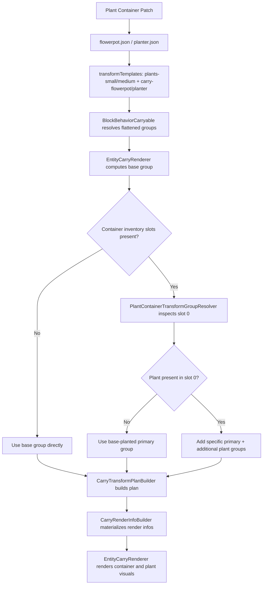

# Carried Plant Container Rendering in CarryOn

This document explains how carried plant containers (flowerpots and planters) are configured and rendered in CarryOn.

It reflects the current implementation, which is template-based and resolver-driven:
- Plant container carryable patches reference `transformTemplates`.
- Transform groups are defined in template JSON files under `config/transformtemplates`.
- Runtime group selection uses base slot/backpack groups (`hands`, `backpack-none`, `backpack-small`, `backpack-large`) and the `plant-container` transform group resolver.

---

## 1. JSON Asset Definitions

Plant container patches are defined in:
- `resources/assets/carryon/patches/carryable/flowerpot.json` (for BlockFlowerPot)
- `resources/assets/carryon/patches/carryable/planter.json` (for BlockPlantContainer)

Both follow the same structure.

### Flowerpot Example (simplified):
```json
"properties": {
  "transformTemplates": [
    "carryon:plants-small",
    "carryon:carry-flowerpot"
  ],
  "renderTransformResolver": "plant-container",
  "renderRootFirst": true,
  "slots": {
    "Hands": { "animation": "carryon:holdlight" },
    "Back": { "enabledCondition": "carryon.CarryablesOnBack.Flowerpot" }
  }
}
```

### Planter Example (simplified):
```json
"properties": {
  "transformTemplates": [
    "carryon:plants-medium",
    "carryon:carry-planter"
  ],
  "renderTransformResolver": "plant-container",
  "renderRootFirst": true,
  "slots": {
    "Hands": { /* disabled or restricted */ },
    "Back": { /* enabled under conditions */ }
  }
}
```

Key properties shared by both:
- `transformTemplates`: references to template codes for size/variant rendering
- `renderTransformResolver`: `plant-container` (enables plant-content-aware group selection)
- `renderRootFirst`: controls render order of root mesh vs accessories
- `slots`: defines available carry slots and restrictions

---

## 2. Where Plant Container Transforms Live

Plant container transforms come from template files:
- `resources/assets/carryon/config/transformtemplates/carry-flowerpot.json`
- `resources/assets/carryon/config/transformtemplates/carry-planter.json` (if planter-specific variants exist)
- `resources/assets/carryon/config/transformtemplates/plants-small.json` (small plant visuals, used by flowerpot)
- `resources/assets/carryon/config/transformtemplates/plants-medium.json` (medium plant visuals, used by planter, if present)

### Container/Base Pose Groups

Each container template (e.g., `carry-flowerpot.json`) defines:
- Base groups:
  - `default`
  - `hands`
  - `backpack-none`
  - `backpack-small`
  - `backpack-large`
- Planted container pose groups:
  - `default-planted`
  - `hands-planted`
  - `backpack-none-planted`
  - `backpack-small-planted`
  - `backpack-large-planted`

These position/orient the container itself and its soil/substrate layer.

### Plant Content Groups

Plant template files (e.g., `plants-small.json`, `plants-medium.json`) define plant visuals and type variants:
- `planted`
- `planted-double`
- `planted-sapling`
- `planted-sapling-oak` (and many other wood types)
- `planted-flower`
- `planted-flower-...`
- `planted-mushroom`
- `planted-fern`
- `planted-croton`
- `planted-cactus`
- `planted-reed-...`

These are additional transforms for plant meshes/items and tint behavior.

---

## 3. BlockBehaviorCarryable and Template Resolution

`BlockBehaviorCarryable`:
- Reads `transformTemplates` from behavior properties.
- Resolves and flattens transform groups into `ResolvedTransformGroups`.
- Supports optional local `transformGroups`/`groups`, but plant containers mainly rely on templates + resolver.

For plant containers, content-based group selection is handled by the `plant-container` transform group resolver rather than by `groups` type suffix mapping alone.

---

## 4. PlantContainerTransformGroupResolver Behavior

The active resolver class is:
- `src/Client/Logic/TransformGroupResolvers/PlantContainerTransformGroupResolver.cs`

It is registered during client startup in `CarrySystem` and applies to blocks with class `BlockFlowerPot` or `BlockPlantContainer`.

Resolver behavior summary:
1. Reads container inventory slots from carried block entity data.
2. If inventory slots are missing or empty:
  - resolver returns `false` and does not provide candidates.
  - plan building falls back to base group behavior (`hands`, `backpack-small`, etc.).
3. If inventory slots exist:
  - starts with a planted primary candidate based on base group:
  - `<baseGroup>-planted` (for example `hands-planted`, `backpack-small-planted`)
4. Reads container slot `0`.
5. If slot `0` is empty:
  - returns with the planted primary candidate only.
6. If slot `0` has plant content:
   - prepends more specific primary candidates for plant class/type (sapling, flower/lupine, mushroom, fern, croton, cactus, reed/cattail root, etc.)
   - adds additional candidate groups for plant visuals (for example `planted-sapling-oak`, `planted-flower`, `planted-mushroom`)
   - adjusts visual scale for large containers (e.g., planters) vs small containers (e.g., flowerpots)
7. Enables vertex warp for additional plant transforms when additional groups are present.

Important: the resolver class name is `PlantContainerTransformGroupResolver` (not `DefaultPlantContainerTransformResolver`).

---

## 5. Runtime Rendering Flow (Client)

Current renderer flow is plan-builder based:
1. `EntityCarryRenderer` resolves base group from slot/backpack context.
2. `GetRenderInfoCached` calls `CarryTransformPlanBuilder.GetOrBuild`.
3. `CarryTransformPlanBuilder`:
   - runs registered transform group resolvers (including `plant-container` when requested via `renderTransformResolver`)
   - chooses primary group from resolver candidates
   - resolves additional groups
   - falls back to `default` settings if needed
4. `CarryRenderInfoBuilder.BuildFromPlan` creates concrete render infos.
5. `EntityCarryRenderer` applies transforms and renders the container and plant visuals.

Note: this path does not use an older direct `GetRenderInfo` API.

---

## 6. Empty vs Planted Examples

### Empty Flowerpot (in hands)
- Base group: `hands`
- Resolver: not used (no container inventory slots in carried data)
- Final primary group: `hands`
- Uses base container pose with no planted overlay groups.

### Empty Large Planter (on back)
- Base group: `backpack-small`
- Resolver: not used (no container inventory slots in carried data)
- Final primary group: `backpack-small`
- Uses base container pose with no planted overlay groups.

### Oak Sapling in Flowerpot
- Base group: `backpack-small`
- Resolver primary candidates (in priority order):
  - `backpack-small-planted-sapling-oak`
  - `backpack-small-planted-sapling`
  - `backpack-small-planted`
- Additional plant group candidates include `planted-sapling-oak` (if available), with fallback to broader plant groups.

### Flower in Large Planter
- Resolver adds flower-focused candidates and additional groups such as `planted-flower` and type-specific flower groups when available.
- Large container size may scale plant visuals appropriately via asset name variants.

---

## 7. Summary Flowchart



---

## 8. References

- `resources/assets/carryon/patches/carryable/flowerpot.json`
- `resources/assets/carryon/patches/carryable/planter.json`
- `resources/assets/carryon/config/transformtemplates/carry-flowerpot.json`
- `resources/assets/carryon/config/transformtemplates/carry-planter.json`
- `resources/assets/carryon/config/transformtemplates/plants-small.json`
- `resources/assets/carryon/config/transformtemplates/plants-medium.json`
- `src/Common/Behaviors/BlockBehaviorCarryable.cs`
- `src/CarrySystem.cs`
- `src/Client/Logic/TransformGroupResolvers/PlantContainerTransformGroupResolver.cs`
- `src/Utility/CarryExtensions.cs`
- `src/Client/Logic/CarryRenderer/EntityCarryRenderer.cs`
- `src/Client/Logic/CarryRenderer/CarryTransformPlanBuilder.cs`
- `src/Client/Logic/CarryRenderer/CarryRenderInfoBuilder.cs`

---

## See Also

- [Transform Template System](transform-template-system.md) — How `transformTemplates` are loaded, merged, and resolved into `ResolvedTransformGroups`.
- [Carried Chest-Trunk and Chest Rendering](carried-chest-trunk-rendering.md) — Parallel doc for chest and trunk rendering, covering type-suffix group selection and straps.
- [Entity Carry Renderer Pipeline](entity-carry-renderer-pipeline.md) — The full client-side rendering pipeline, including how `renderTransformResolver` is invoked during plan resolution.

---

This document is intended as a technical reference for understanding and debugging carried plant container (flowerpot and planter) rendering in CarryOn.
