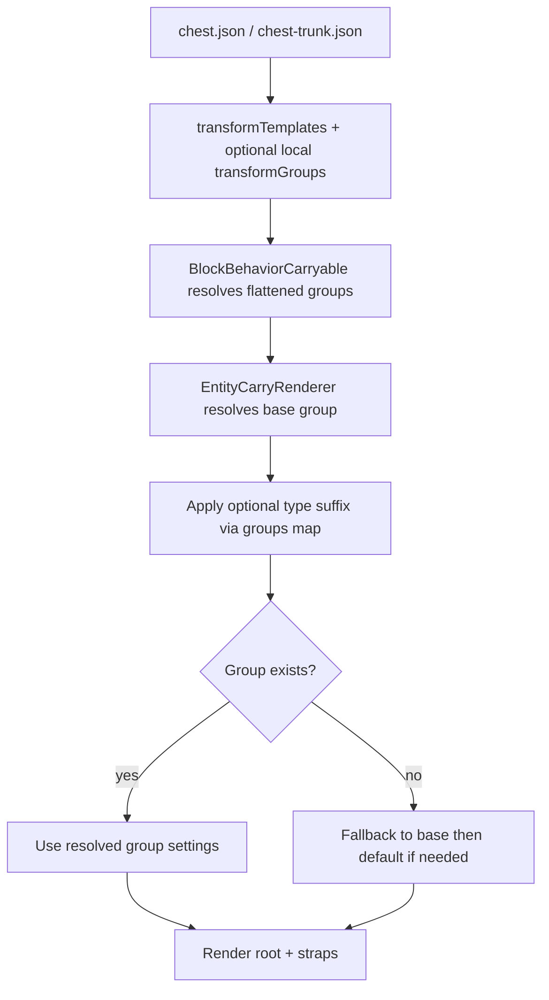

# Carried Chest-Trunk and Chest Rendering in CarryOn

This document explains how carried chest-trunk and chest blocks are configured and rendered in CarryOn.

It reflects the current system, which is template-based:
- Carryable patches reference `transformTemplates`.
- Transform groups are defined in template JSON files under `config/transformtemplates`.
- Runtime group selection uses base slot/backpack groups (`hands`, `backpack-none`, `backpack-small`, `backpack-large`) plus optional type-group suffixes (such as `-normal` or `-compact`).

Template code canonical form is `modid:code`. Bare `transformTemplates` values default to `carryon:<code>` during lookup.

## 0. Overview: Shared Rendering Pipeline

Both chest-trunk and chest use the same rendering pipeline:
- JSON patches add `Carryable` behavior and slot rules.
- Transform definitions come from `transformTemplates` (plus optional local `transformGroups` in the patch).
- `BlockBehaviorCarryable` resolves templates into flattened `ResolvedTransformGroups`.
- At render time, a base group is chosen from slot + backpack type.
- If the carried stack has a `type` attribute and the block has a `groups` map, a suffix can be appended (for example `backpack-small` -> `backpack-small-normal`).
- The renderer uses the resolved group transforms; if none are available it can fall back to `default` settings.

---

## 1. JSON Asset Definitions

### 1A. Chest

The chest carryable patch is defined in:
- `resources/assets/carryon/patches/carryable/chest.json`

Key points:
- Defines a `groups` map for type-to-suffix mapping (`normal`, `compact`).
- Uses `transformTemplates`:
  - `carry-chest`
  - `carry-chest-compact`
- Defines local `transformGroups` aliases so normal variants resolve to `backpack-*-normal` groups by extending base backpack groups.
- Defines slots (`Hands`, `Back`) and restrictions (`excludedTypes`).

Example (simplified):
```json
"groups": {
  "normal": ["normal-generic", "normal-aged"],
  "compact": ["golden", "owl", "golden-aged", "owl-aged"]
},
"transformTemplates": [
  "carry-chest",
  "carry-chest-compact"
],
"transformGroups": {
  "backpack-none-normal": { "extends": "backpack-none" },
  "backpack-small-normal": { "extends": "backpack-small" },
  "backpack-large-normal": { "extends": "backpack-large" }
}
```

### 1B. Chest-Trunk

The chest-trunk carryable patch is defined in:
- `resources/assets/carryon/patches/carryable/chest-trunk.json`

Key points:
- Uses `transformTemplates`: `carry-trunk`
- Defines slots (`Hands`, `Back`) and restrictions (`excludedTypes`).
- Does not define local `groups` mapping for variant suffixes.

Example (simplified):
```json
"transformTemplates": ["carry-trunk"],
"slots": {
  "Hands": { "animation": "carryon:holdheavy", "walkSpeedModifier": -0.5 },
  "Back":  { "walkSpeedModifier": -0.2, "enabledCondition": "..." }
}
```

---

## 2. Where Transforms Actually Live

The actual chest/trunk transform groups live in transform template files:
- `resources/assets/carryon/config/transformtemplates/carry-chest.json`
- `resources/assets/carryon/config/transformtemplates/carry-chest-compact.json`
- `resources/assets/carryon/config/transformtemplates/carry-trunk.json`

These define groups such as:
- `hands`
- `backpack-none`
- `backpack-small`
- `backpack-large`
- `backpack-none-compact`
- `backpack-small-compact`
- `backpack-large-compact`

They also define inheritance via `extends` and per-id `overrides` (for example adjusting only `root` and selected straps for backpack size variants).

---

## 3. BlockBehaviorCarryable: Initialization and Group Resolution

`BlockBehaviorCarryable`:
- Reads `transformTemplates` from behavior properties.
- Detects local `transformGroups` and merges them over template definitions.
- Parses `groups` into a `TypeGroup` dictionary (type -> suffix group).
- Resolves and flattens transform groups into `ResolvedTransformGroups`.

Type-based suffixing:
- `GetTransformGroupName(carried, baseGroup)` reads `ItemStack.Attributes["type"]`.
- If that type maps via `TypeGroup`, it tries appending `-<group>`.
- With default `checkExists=true`, suffix is applied only if the resulting group exists.

Example:
- Base group `backpack-small`
- Type `normal-generic` -> group suffix `normal`
- Candidate becomes `backpack-small-normal`

---

## 4. Base Group Selection (Hands vs Backpack Size)

`ResolveCarryTransformGroupBase` chooses the base group:
- Hands slot -> `hands`
- Back slot with recognized backpack mapping -> `backpack-small` or `backpack-large` (or other configured backpack type)
- Otherwise -> `backpack-none`

For non-player entities, the fallback base is `default`.

---

## 5. Runtime Rendering Flow (Client)

`EntityCarryRenderer` rendering path:
1. Gets base group using `ResolveCarryTransformGroupBase`.
2. Calls `GetRenderInfoCached`, which uses `CarryTransformPlanBuilder`.
3. `CarryTransformPlanBuilder` resolves the primary group from candidates:
   - Try candidate group(s) + type suffix resolution
   - Try fallback base group + type suffix resolution
   - Fall back to base group string
4. If resolved group has transforms, build effective settings from that group.
5. If no settings are found, try `default` transform group settings.
6. `CarryRenderInfoBuilder` materializes per-transform render info.
7. Renderer applies transforms and draws root mesh plus strap items.

Note: this path is plan-builder based; it does not use an older `GetRenderInfo` API.

---

## 6. Straps and Additional Transforms

Straps are configured as additional transform entries, typically with:
- `id` like `strap-top-left`, `strap-bottom-right`, etc.
- `item`: `carryon:strap`
- Their own translation, rotation, and scale

Because groups use `extends` + `overrides`, backpack size variants can adjust only specific strap/root values while inheriting the rest.

---

## 7. Examples

### Default normal chest on back
- Base group: `backpack-none`
- Type group suffix: `-normal`
- Result: `backpack-none-normal`

### Small compact chest on back
- Base group: `backpack-small`
- Type group suffix: `-compact`
- Result: `backpack-small-compact`

### Large trunk on back
- Base group: `backpack-large`
- No type suffix mapping for trunk
- Result: `backpack-large`

### Trunk in hands
- Base group: `hands`
- Result: `hands`

---

## 8. Summary Flowchart



---

## 9. References

- `resources/assets/carryon/patches/carryable/chest.json`
- `resources/assets/carryon/patches/carryable/chest-trunk.json`
- `resources/assets/carryon/config/transformtemplates/carry-chest.json`
- `resources/assets/carryon/config/transformtemplates/carry-chest-compact.json`
- `resources/assets/carryon/config/transformtemplates/carry-trunk.json`
- `src/Common/Behaviors/BlockBehaviorCarryable.cs`
- `src/Utility/CarryExtensions.cs`
- `src/Client/Logic/CarryRenderer/EntityCarryRenderer.cs`
- `src/Client/Logic/CarryRenderer/CarryTransformPlanBuilder.cs`
- `src/Client/Logic/CarryRenderer/CarryRenderInfoBuilder.cs`

---

## See Also

- [Transform Template System](transform-template-system.md) — How `transformTemplates` are loaded, merged, and resolved into `ResolvedTransformGroups`.
- [Carried Plant Container Rendering](carried-plant-container-rendering.md) — Parallel doc for flowerpot and planter rendering, including the `plant-container` resolver path.
- [Entity Carry Renderer Pipeline](entity-carry-renderer-pipeline.md) — The full client-side rendering pipeline that consumes the resolved transform groups at runtime.

---

This document is intended as a technical reference for understanding and debugging carried chest-trunk and chest rendering in CarryOn.
