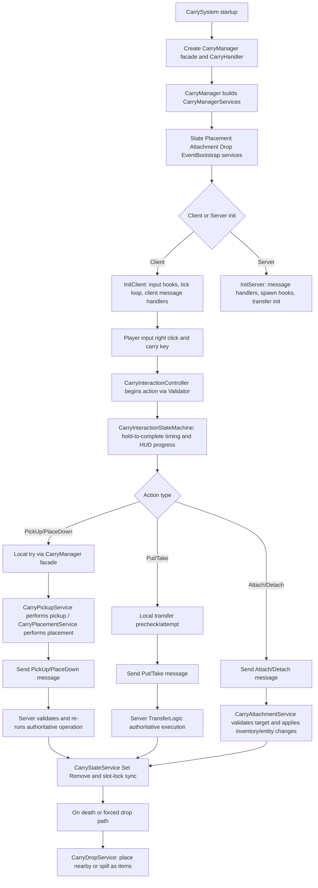

# CarryManager and Handler Pipeline in CarryOn

This document explains the carry management and interaction pipeline centered on `CarryManager` and `CarryHandler`.

It reflects the current implementation:
- `CarryManager` is a facade over dedicated domain services and remains the public authority exposed through `ICarryManager`.
- `CarryHandler` is the orchestration layer that wires input, network messages, server validation, and interaction state progression.
- `CarryInteractionController`, `CarryInteractionStateMachine`, and `CarryInteractionValidator` drive client-side carry action state (`PickUp`, `PlaceDown`, `SwapBack`, `Attach`, `Detach`, `Put`, `Take`, `Interact`).
- `TransferLogic` handles carryable transfer into and out of block entities via pluggable transfer handlers.
- `DeathHandler` enforces carried-item drop behavior on player death based on vanilla keep-contents rules.

## 0. Scope

This pipeline covers:
- `src/Common/Services/CarryManager.cs`
- `src/Common/Services/CarryManagerServices.cs`
- `src/Common/Services/CarryStateService.cs`
- `src/Common/Services/CarryPlacementService.cs`
- `src/Common/Services/CarryPickupService.cs`
- `src/Common/Services/CarryAttachmentService.cs`
- `src/Common/Services/CarryDropService.cs`
- `src/Common/Services/CarryEventBootstrapper.cs`
- `src/Common/Handlers/CarryHandler.cs`
- `src/Common/Handlers/DeathHandler.cs`
- `src/Client/Logic/Interaction/CarryInteractionController.cs`
- `src/Client/Logic/Interaction/CarryInteractionStateMachine.cs`
- `src/Client/Logic/Interaction/CarryInteractionValidator.cs`
- `src/Common/Logic/TransferLogic.cs`
- `src/Common/Models/CarryInteraction.cs`
- `src/CarrySystem.cs`
- `../CarryOnLib/src/API/Common/Interfaces/ICarryManager.cs`

---

## 1. High-Level Responsibilities

### 1A. `CarryManager`

Core responsibilities:
- Exposes the public carry API (`ICarryManager`) used by CarryOn internals and other mods.
- Delegates operational behavior to `CarryManagerServices` domain services:
  - `CarryStateService` for watched-attribute state, revisions, slot locks, animation/stat side effects.
  - `CarryPlacementService` for pickup, placement, permission checks, and block entity restore.
  - `CarryAttachmentService` for attach/detach between player hands and entity slots.
  - `CarryDropService` for drop placement fallback and item spill/drop behavior.
  - `CarryEventBootstrapper` for `ICarryEventHandler` discovery and initialization.
- Maintains transform group resolver registration for renderer-side transform group planning.

### 1A.1 Service Delegation Matrix

`CarryManager` method routing:
- State: `GetAllCarried`, `GetCarried`, `SetCarried`, `RemoveCarried`, `SwapCarried`, `LockHotbarSlots`, `TouchCarriedAttributes`, `GetCarriedRevision` -> `CarryStateService`
- Pickup: `HasPermissionToCarry`, `GetCarriedFromWorld`, `TryPickUp` -> `CarryPickupService`
- Placement: `RestoreBlockEntityData`, `TryPlaceDown`, `TryPlaceDownAt` -> `CarryPlacementService`
- Attachment: `TryAttach`, `TryDetach` -> `CarryAttachmentService`
- Drop: `DropCarried`, `DropCarriedBlock`, `DropBlockAsItem` -> `CarryDropService`
- Event bootstrap: `InitEvents` -> `CarryEventBootstrapper`

### 1B. `CarryHandler`

Orchestration responsibilities:
- Initializes client and server carry pipelines from `CarrySystem`.
- Registers carry network message types and per-message handlers.
- Wires client input events and game tick loop into `CarryInteractionController`.
- Wires server message handlers into `CarryManager` and `TransferLogic` with authority checks.
- Prevents active hotbar slot switching while carrying in hands.
- Reapplies carry state effects on entity/player spawn so animations/stats/locks are restored.

### 1C. Client Interaction Components

The client interaction system was split into three components during refactoring:

**`CarryInteractionController`** — Top-level orchestrator:
- Creates and manages `CarryInteractionStateMachine` and `CarryInteractionValidator`.
- Provides external hooks for `TryBeginInteraction` and `TryContinueInteraction`.
- Exposes the `ICarryInteractionController` interface consumed by `CarryHandler`.

**`CarryInteractionStateMachine`** — Client interaction state machine:
- Tracks active interaction context in `CarryInteraction`.
- Progresses timed interactions each tick and dispatches corresponding client packets.
- Performs client-side prechecks and local transfer calls (`Put`/`Take`) before server packet send.
- Cancels/completes interaction state and updates carry HUD progress/refresh behavior.

**`CarryInteractionValidator`** — Interaction validation:
- Detects and begins valid interaction intents based on right-click + carry key context.
- Applies permission checks (e.g. `HasPermissionToCarry` for place-down).
- Enforces entity attach/detach validation rules.

### 1D. `TransferLogic`

Transfer subsystem responsibilities:
- Configures transfer handlers for carryable blocks by scanning mod assemblies for `ICarryableTransfer` implementors.
- Validates transfer feasibility (`CanPutCarryable`, `CanTakeCarryable`).
- Executes transfer operations (`TryPutCarryable`, `TryTakeCarryable`) and applies carry state changes through `CarryManager`.

### 1E. `DeathHandler`

Death flow responsibility:
- On player death, drops all carried blocks unless vanilla keep-contents behavior is active (`keepContents == true`).

---

## 2. System Lifecycle Integration

`CarrySystem.Start`:
- Registers carry behaviors (`BlockBehaviorCarryable`, `BlockBehaviorCarryableInteract`, `EntityBehaviorAttachableCarryable`).
- Creates `CarryHandler` and `CarryEvents`.
- Retrieves CarryOnLib mod system and installs `CarryManager` implementation.

`CarrySystem.StartClientSide`:
- Registers client channel.
- Creates renderer/HUD systems.
- Calls `CarryHandler.InitClient`.
- Calls `CarryManager.InitEvents`.
- Registers transform group resolvers (`plant-container`, `display-case`, `mold-rack`, `generic-code-path`).

`CarrySystem.StartServerSide`:
- Registers `EntityBehaviorDropCarriedOnDamage`.
- Registers server channel.
- Creates `DeathHandler`.
- Calls `CarryHandler.InitServer`.
- Calls `CarryManager.InitEvents`.

---

## 3. Carried State Storage Model

`CarryManager.GetCarried` / `SetCarried` / `RemoveCarried` use watched attributes under:
- `AttributeKey.Watched.EntityCarried`
- slot key (`Hands`, `Back`, etc.)
- child keys:
  - `Stack` for block item stack
  - `Data` for serialized block entity data

Important implementation behavior:
- `GetCarried` resolves `ItemStack.Block` if missing after tree deserialization.
- `SetCarried` starts configured carry animation, applies walkspeed modifiers, and updates hand lock state.
- `RemoveCarried` stops animation, removes walkspeed modifier, restores lock states, and clears watched + entity attributes.
- Server-side set/remove calls increment carried revision via `TouchCarriedAttributes` and marks `AttributeKey.Watched.EntityCarried` dirty.
- `TouchCarriedAttributes` stores integer revision at `AttributeKey.CarriedRevision` under the carried root.

---

## 4. Pickup and Place-Down Pipeline

`TryPickUp` flow (`CarryPickupService` via `CarryManager`):
1. Server: permission check (`HasPermissionToCarry`) against claims/reinforcement and external delegates.
2. Reject if target carry slot already occupied.
3. Validate carryability and optimistic pickup behavior (`BlockBehaviorCarryable.OptimisticPickup`).
4. Build `CarriedBlock` from world position (`GetCarriedFromWorld`) and invoke pre-remove delegates.
5. Remove world block (+ clear reinforcement + neighbor update).
6. Set carried state on entity and play carry sound profile.
7. Audit log on server.

`TryPlaceDownAt` + `TryPlaceDown` flow (`CarryPlacementService` via `CarryManager`):
1. Resolve actual placement position (replace selected block or offset by face).
2. For player placements, route through block `TryPlaceBlock` with temporary active-slot phantom stack.
3. Force Shift=true and Ctrl=false during placement attempt (compatibility workaround), then restore controls.
4. For dropped placements (or non-player placement paths), directly exchange block/spawn block entity and call `OnBlockPlaced`.
5. Restore serialized block entity data at final position.
6. Mark block dirty, trigger neighbor update, remove carried state, play sound, raise drop event when applicable.

---

## 5. Drop Pipeline and Failure Fallback

`DropCarried` flow (`CarryDropService`):
- For each requested carried slot, finds candidate placement near entity using `BlockPlacer`.
- If a placement is found, attempts dropped placement (`TryPlaceDown(..., dropped: true)`).
- If no placement or placement fails, falls back to `DropBlockAsItem`.

`DropBlockAsItem` behavior:
- If carried block contains serialized inventory, spills contents as item entities and drops block stack.
- Otherwise uses block drop table; if drops differ from carried stack, block is treated as destroyed.
- Plays break sound, removes carried state, logs audit, and triggers block-dropped carry events with metadata (`blockDestroyed`, `hadContents`, `blockPlaced: false`).

---

## 6. Permission, Rules, and Event Hooks

Permission checks (`CarryPickupService.HasPermissionToCarry`):
- Invokes `CheckPermissionToCarry` delegates first (can explicitly allow/deny).
- Applies reinforcement + claim checks for player entities.
- Non-player entities are restricted only by reinforcement state.

Carry event delegate integration points:
- Before pickup: `BeforePickUpBlock`
- Before world remove: `BeforeRemoveBlockFromWorld`
- Before block entity restore: `BeforeRestoreBlockEntityData`
- Permission override: `CheckPermissionToCarry`
- Drop notification: `TriggerBlockDropped`

`CarryEventBootstrapper.InitEvents` initializes registered `ICarryEventHandler` implementations from mod assemblies.

---

## 7. CarryHandler Client Pipeline

`InitClient` registers:
- message types and lock-slot message handler
- carry hotkeys
- in-world action hook (`OnEntityAction`)
- game tick listener (`OnGameTick`)
- active-slot-change prevention hook
- player spawn and player-ready hooks

Runtime behavior:
- `OnEntityAction` starts/cancels interactions through `CarryInteractionController`.
- `OnGameTick` advances interaction timer/progress via `CarryInteractionStateMachine` and refreshes interaction help when carry capability state changes.
- `OnBeforeActiveSlotChanged` prevents hotbar active slot changes while hands slot is carrying.
- On player-ready (client) and server init paths, transfer behaviors are discovered and configured through `TransferLogic.InitTransferBehaviors`.

---

## 8. CarryHandler Server Pipeline

`InitServer` registers:
- all carry message types
- authoritative handlers for interaction, pickup, placement, swapping, attach/detach, transfer put/take, and dismount
- spawn/player-now-playing hooks to reapply carry state side effects
- active-slot-change prevention hook
- transfer behavior initialization when CarryOn is enabled

Validation examples in server handlers:
- pickup/place: slot constraints, can-interact checks, failure-code based user feedback
- attach/detach: entity existence, range checks, slot validity, occupancy, compatibility, and inventory-open guards
- put/take: delegates to `TransferLogic` and propagates on-screen errors

---

## 9. Attachment Service Pipeline

`CarryAttachmentService.TryAttach`:
1. Validate target entity id, range, attachable behavior, and ownership requirements.
2. Validate source carried block in hands and required block entity data.
3. Resolve target slot from selection-box index and ensure slot is not occupied (including seat occupancy checks).
4. Convert carried block inventory payload into attachable slot-compatible backpack attributes.
5. Run compatibility checks (`CanTakeFrom`, `PreventAttaching`, optional `IAttachedInteractions.OnTryAttach`).
6. Move stack into target slot, persist entity inventory/cache updates, remove carried hands state, play sound, audit.

`CarryAttachmentService.TryDetach`:
1. Validate target entity and attachable context.
2. Validate source slot occupancy and takeability.
3. Validate source is carryable and that no other player has related storage inventory open.
4. Rebuild carried block entity data from attached stack backup/backpack attributes.
5. Set carried hands state, clear source slot and cached slot storage, persist inventory, shape/chunk dirty, optional listener callbacks, audit.

---

## 10. Interaction State Machine

`CarryInteraction` stores transient action context:
- `CarryAction`
- elapsed hold time
- source/target carry slot
- target block position
- target entity and slot index
- optional transfer delay override

`CarryInteractionValidator.TryBeginInteraction` (called via `CarryInteractionController`) picks action in priority order, including:
- entity attach/detach
- swap-back
- block interact behavior
- transfer put/take
- block pickup/place-down

`CarryInteractionStateMachine.TryContinueInteraction`:
- validates that preconditions still hold while button is held
- computes required hold duration from behavior settings + config multipliers
- drives HUD progress
- executes action locally and sends corresponding network packet when successful
- emits localized failure messaging for rejected operations
- coalesces interaction-help refresh requests and flushes them safely via reflected HUD method invocation

---

## 11. TransferLogic Integration

Transfer behavior model:
- A carryable block can expose `TransferEnabled` and a `TransferHandler`.
- Handler methods gate and execute transfer (`CanPut/CanTake`, `TryPut/TryTake`).

`TryPutCarryable`:
- requires carried block in hands
- validates target block entity + carryable transfer handler
- invokes transfer handler
- on success removes carried hands block via `CarryManager.RemoveCarried`

`TryTakeCarryable`:
- requires empty hands carry slot
- validates target block entity + carryable transfer handler
- invokes transfer handler to materialize `ItemStack` + block entity data
- on success installs carried hands block via `CarryManager.SetCarried`

---

## 12. Death Handling

`DeathHandler` subscribes to server `PlayerDeath`:
- If player server attributes do not indicate `keepContents == true`, it drops all carried blocks from the dead player entity.
- This aligns carry drop behavior with vanilla keep-inventory semantics.

---

## 13. Summary Flowchart

---

## 14. References

- `src/Common/Services/CarryManager.cs`
- `src/Common/Services/CarryManagerServices.cs`
- `src/Common/Services/CarryStateService.cs`
- `src/Common/Services/CarryPlacementService.cs`
- `src/Common/Services/CarryPickupService.cs`
- `src/Common/Services/CarryAttachmentService.cs`
- `src/Common/Services/CarryDropService.cs`
- `src/Common/Services/CarryEventBootstrapper.cs`
- `src/Common/Handlers/CarryHandler.cs`
- `src/Common/Handlers/DeathHandler.cs`
- `src/Client/Logic/Interaction/CarryInteractionController.cs`
- `src/Client/Logic/Interaction/CarryInteractionStateMachine.cs`
- `src/Client/Logic/Interaction/CarryInteractionValidator.cs`
- `src/Common/Logic/TransferLogic.cs`
- `src/Common/Models/CarryInteraction.cs`
- `src/CarrySystem.cs`
- `../CarryOnLib/src/API/Common/Interfaces/ICarryManager.cs`

---

## See Also

- [Transform Template System](transform-template-system.md) — How carryable transform groups are resolved before rendering.
- [Entity Carry Renderer Pipeline](entity-carry-renderer-pipeline.md) — Client rendering pipeline that consumes carried state and resolved transform groups.
- [Carried Plant Container Rendering](carried-plant-container-rendering.md) — Example of resolver-driven carried rendering behavior.
- [Carried Chest-Trunk and Chest Rendering](carried-chest-trunk-rendering.md) — Example of template + group mapping behavior for storage blocks.

---

This document is intended as a technical reference for understanding and debugging carry state, interaction orchestration, and transfer/death handling in CarryOn.
