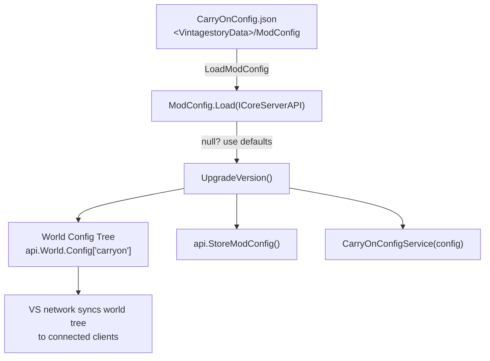
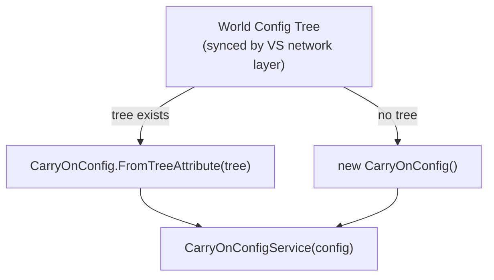
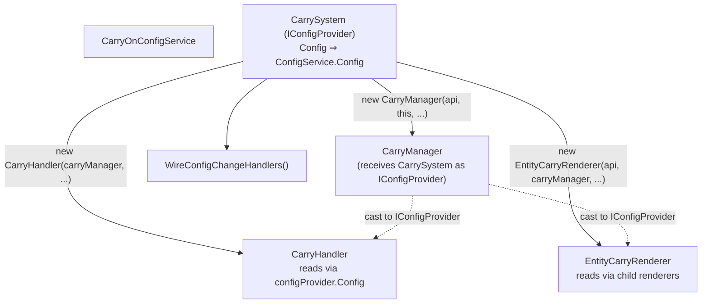
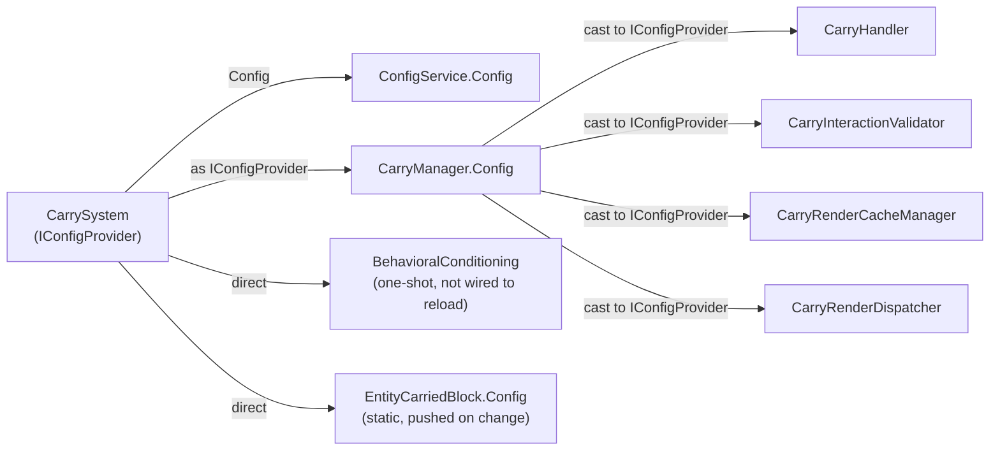
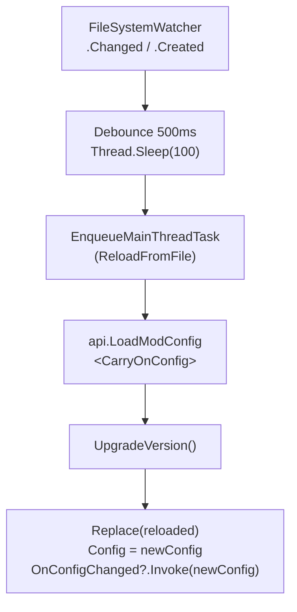
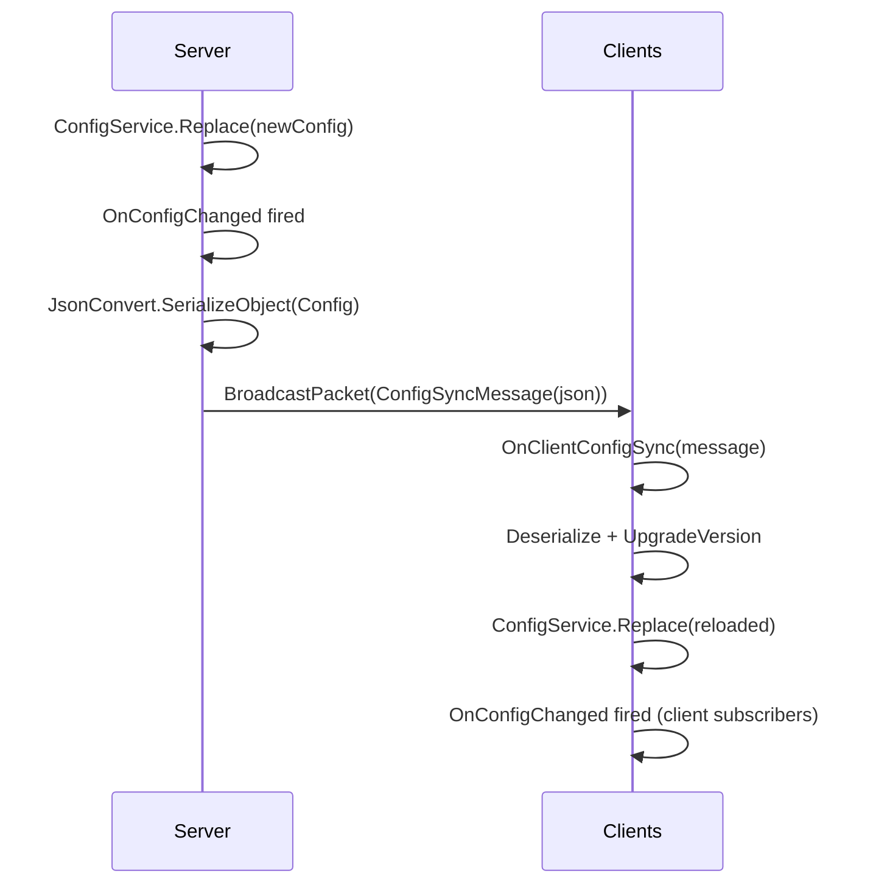
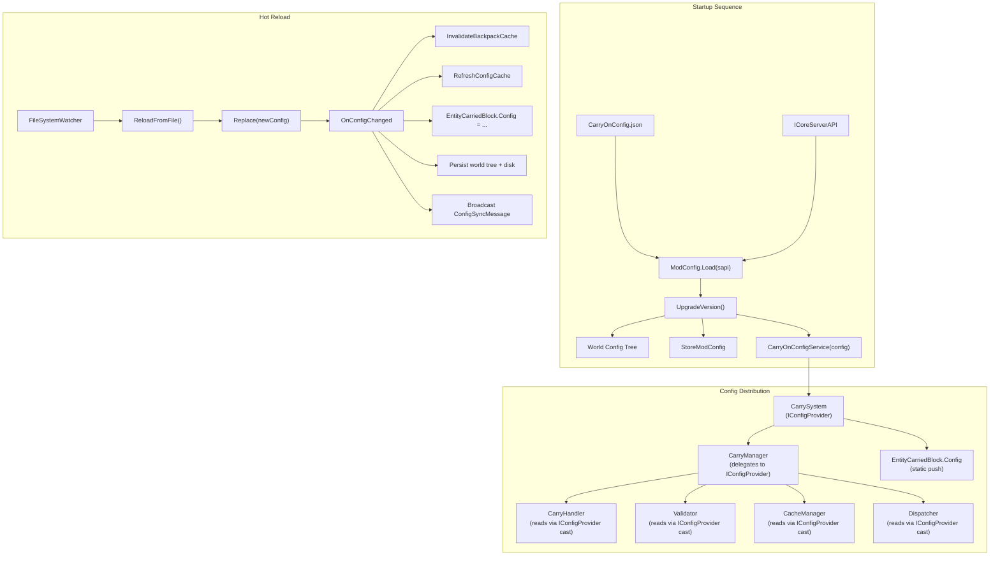

# Config Initialization and Flow

This document traces how `CarryOnConfig` is created, distributed, and hot-reloaded
through the system — from disk to every consumer.

---

## 1. Interface: `IConfigProvider`

**File:** `src/Common/Interfaces/IConfigProvider.cs`

```csharp
public interface IConfigProvider
{
    CarryOnConfig Config { get; }
}
```

Minimal interface. Two implementers:

| Implementer | File | Behavior |
|---|---|---|
| `CarrySystem` | `src/CarrySystem.cs:42` | Returns `ConfigService.Config` |
| `CarryManager` | `src/Common/Services/CarryManager.cs:21` | Delegates to its stored `IConfigProvider` (`CarrySystem`) |

### Config Access Pattern

`ICarryManager` (in CarryOnLib) cannot expose `CarryOnConfig` directly —
the config type is too volatile for the API library. Consumers that need
config hold `ICarryManager` and cast to `IConfigProvider` once in their
constructor:

```csharp
this.configProvider = (IConfigProvider)carryManager
    ?? throw new ArgumentException("carryManager must implement IConfigProvider", ...);
```

This cast is safe: `CarryManager` is the only `ICarryManager` implementation
and always implements both interfaces. The cast fires once per instance and
has zero hot-path cost.

**4 consumers use this pattern:**
- `CarryHandler` (`src/Common/Handlers/CarryHandler.cs`)
- `CarryInteractionValidator` (`src/Client/Logic/Interaction/`)
- `CarryRenderCacheManager` (`src/Client/Logic/CarryRenderer/`)
- `CarryRenderDispatcher` (`src/Client/Logic/CarryRenderer/`)

---

## 2. Initialization Sequence

### 2a. Server Startup (`StartPre`)



**`ModConfig.Load(ICoreServerAPI)`** returns `CarryOnConfig?`:

```csharp
// src/Server/Logic/ModConfig.cs
public CarryOnConfig? Load(ICoreServerAPI api)
{
    var config = api.LoadModConfig<CarryOnConfig>(ConfigFile)
                 ?? new CarryOnConfig(CurrentConfigVersion);
    config.UpgradeVersion();
    api.StoreModConfig(config, ConfigFile);
    // write to world config tree (needed for client sync)
    var worldTree = api.World.Config.GetOrAddTreeAttribute("carryon");
    worldTree.MergeTree(config.ToTreeAttribute());
    return config;   // caller uses this directly
}
```

### 2b. Client Startup (`StartPre`)



The **client** never reads `CarryOnConfig.json` from disk. It receives the config
via the server's world config sync (VS built-in) or via the `ConfigSyncMessage`
network packet (for hot-reload).

### 2c. Server + Client Combined (`StartPre`)

```csharp
// src/CarrySystem.cs
CarryOnConfig config;

if (api is ICoreServerAPI sapi)
{
    config = new ModConfig().Load(sapi) ?? new CarryOnConfig();
}
else
{
    var tree = api.World.Config?.GetTreeAttribute(ModId);
    config = tree != null
        ? CarryOnConfig.FromTreeAttribute(tree)
        : new CarryOnConfig();
}

ConfigService = new CarryOnConfigService(config);
```

**Key improvement over the old architecture:** The server no longer performs a
redundant deserialization round-trip. `ModConfig.Load()` returns the loaded
config directly. The world config tree is still written (for client sync), but
the server doesn't read it back.

### 2d. Distribution (`Start`)



No consumer stores a private `CarryOnConfig` copy. All read live from
`carryManager` via the cast-to-`IConfigProvider` pattern.

---

## 3. Config Consumer Chain



| Consumer | Access Path | Reacts to Change? |
|---|---|---|
| `CarryHandler` | `configProvider.Config.X` | Yes — relays to `RefreshConfigCache()` |
| `CarryInteractionValidator` | `configProvider.Config.X` | Yes — re-parses `PreventSwapFromBackOnTarget` |
| `CarryRenderCacheManager` | `configProvider.Config.X` | No — reads live each render tick |
| `CarryRenderDispatcher` | `configProvider.Config.X` | No — reads live each render tick |
| `EntityCarriedBlock` (static) | Pushed via subscriber | Yes — `Config = Config.CarriedBlockEntity` |
| `BehavioralConditioning` | Direct `CarryOnConfig` param | No — one-shot at `AssetsFinalize` |

---

## 4. Config Hotloading

### 4a. Triggers

| Trigger | Initiator | Path |
|---|---|---|
| File change (disk) | `CarryOnConfigService.SetupFileWatcher()` | `OnConfigFileChanged()` → `ReloadFromFile()` → `Replace()` |
| Network sync | Server broadcasts `ConfigSyncMessage` | Client `CarrySystem.OnClientConfigSync()` → `ConfigService.Replace()` |
| Console command | `/carryon reload` | Calls `ConfigService.Reload()` |
| Programmatic | Any code | Calls `ConfigService.Replace(newConfig)` |

### 4b. File Watcher (Server Only)

`CarryOnConfigService.SetupFileWatcher(ICoreServerAPI)` creates a
`FileSystemWatcher` on `<VintagestoryData>/ModConfig/CarryOnConfig.json`:



Disabled when `DebuggingOptions.DisableConfigWatcher` is `true`.

### 4c. `Replace()` — The Central Mutation Point

`CarryOnConfigService.Replace(CarryOnConfig newConfig)` is the single entry
point for all config changes. It swaps the in-memory config and fires the event:

```csharp
public void Replace(CarryOnConfig newConfig)
{
    Config = newConfig;
    OnConfigChanged?.Invoke(newConfig);
}
```

### 4d. Subscriber Chain (`WireConfigChangeHandlers()`)

All in `CarrySystem.Start()`:

| Order | Subscriber | Effect |
|---|---|---|
| 1 | `Config.InvalidateBackpackCache()` | Clears lazy-parsed `BackpackMapping` dictionary |
| 2 | `CarryHandler?.RefreshConfigCache()` | Forwards to `InteractionController` → `Validator` → re-parses `PreventSwapFromBackOnTarget` filters |
| 3 | `EntityCarriedBlock.Config = Config.CarriedBlockEntity` | Carried block entity behavior settings |
| 4 | (server) persist to world config + disk | `ServerApi.StoreModConfig(Config, ConfigFile)` |
| 5 | (server) broadcast to clients | `ServerChannel.BroadcastPacket(new ConfigSyncMessage(json))` |

No more forwarding to 6+ individual `UpdateConfig()` methods. Consumers
read config live from `carryManager` — they don't need to be pushed a copy.

### 4e. Network Sync



---

## 5. Full Flow Diagram



---

## 6. Key Design Points

- **`ConfigService` is the single source of truth.** `CarrySystem.Config` delegates
  to it. `CarryManager.Config` delegates through `CarrySystem` via `IConfigProvider`.
- **No private copies.** All consumers read config live from `carryManager` via the
  `IConfigProvider` cast. `UpdateConfig()` no longer exists.
- **Server-authoritative.** Only the server can trigger hot-reload from disk.
  Clients receive the config as a serialized JSON message.
- **One serialization at startup.** `ModConfig.Load()` returns the loaded config
  directly. The server no longer reads it back from the world config tree. The
  world tree is still written (for client sync), but only the client deserializes
  from it.
- **`BehavioralConditioning` is NOT wired to hot-reload.** It runs once at
  `AssetsFinalize`. Carryables, interactables, and filter changes require restart.
- **The cast pattern is a deliberate trade-off.** `ICarryManager` (CarryOnLib)
  can't reference the volatile `CarryOnConfig` type. The runtime cast to
  `IConfigProvider` is safe (`CarryManager` always implements both) and has
  zero hot-path cost. Four consumers use it.
