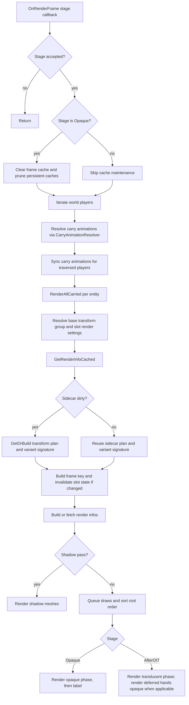

# Entity Carry Renderer Pipeline in CarryOn

This document explains the client-side carried-block rendering pipeline implemented under CarryOn.Client.Logic.CarryRenderer.

It reflects the current implementation:
- `EntityCarryRenderer` orchestrates stage registration, per-frame traversal, animation sync, and final draw submission.
- `CarryAnimationResolver` resolves effective hand-carry animation codes (base/sit/crouch) and known animation sets.
- `CarryTransformPlanBuilder` resolves transform-group plans (primary plus additional groups) and caches them.
- `CarryRenderInfoBuilder` materializes concrete render infos from plan settings and optional container-slot sources.
- `CarryRenderCache` holds transform plans, persistent render infos, frame-local render infos, and per-slot invalidation state.
- `CarryRenderHelpers` provides signatures, transform math, render phase decisions, tint sampling, and utility clones.
- `CarriedLabelRenderer` and `CarriedLabelManager` render carried labels (text or icon) when configured.

## 0. Namespace Scope

The pipeline in this document covers all classes in:
- `src/Client/Logic/CarryRenderer/EntityCarryRenderer.cs`
- `src/Client/Logic/CarryRenderer/CarryAnimationResolver.cs`
- `src/Client/Logic/CarryRenderer/CarryTransformPlanBuilder.cs`
- `src/Client/Logic/CarryRenderer/CarryRenderInfoBuilder.cs`
- `src/Client/Logic/CarryRenderer/CarryRenderCache.cs`
- `src/Client/Logic/CarryRenderer/CarryRenderHelpers.cs`
- `src/Client/Logic/CarryRenderer/CarriedLabelRenderer.cs`
- `src/Client/Logic/CarryRenderer/CarriedLabelManager.cs`

---

## 1. High-Level Responsibilities

### 1A. `EntityCarryRenderer`

Core orchestrator responsibilities:
- Registers renderer for `Opaque`, `AfterOIT`, `ShadowFar`, `ShadowNear` stages.
- Iterates players each frame, culls non-rendered remote entities per stage, and renders carried blocks.
- Computes entity/slot matrices, resolves first-person hands matrix behavior, and emits draw calls.
- Uses per-entity/slot signature sidecars to avoid unnecessary transform-plan and variant-signature recomputation.
- Splits non-shadow rendering across stages:
  - `Opaque` stage renders opaque carried content.
  - `AfterOIT` stage renders translucent carried content.
  - Local first-person hands opaque can be deferred to `AfterOIT` so hands still composite over water correctly.
- Syncs carry hold animations for players during traversal (resolved via `CarryAnimationResolver`) and scrubs stale tracked state for entities no longer seen.
- Delegates label rendering after any carried entry's opaque phase is rendered.

### 1B. `CarryAnimationResolver`

Animation resolution responsibilities:
- Detects sitting state (`floor sitting` or mounted) for animation selection.
- Resolves effective hands animation code from slot settings and stance (`Animation`, `AnimationSit`, `AnimationCrouch`).
- Applies default sit/crouch fallback mappings for common base carry animations when explicit overrides are not provided.
- Returns the known set of hand animation codes used by `EntityCarryRenderer` safety scrub logic.

### 1C. `CarryTransformPlanBuilder`

Plan resolution responsibilities:
- Invokes the requested transform-group resolver (when `transformGroupResolver` is set) and collects primary group candidates.
- Resolves additional group candidates (including optional slot-key source and vertex-warp marker).
- Resolves final primary group with fallback chain and type-suffix existence checks.
- Falls back to `default` group settings if no effective settings are produced.
- Produces a `CachedTransformPlan` keyed by transform-plan signature.

### 1D. `CarryRenderInfoBuilder`

Render-info materialization responsibilities:
- Converts effective plan settings into concrete `CarriedRenderInfo[]`.
- Resolves target mesh source from one of:
  - resolver source slot stack,
  - block-entity path stack source (`BlockEntityDataItemStackPath`),
  - explicit asset in transform setting,
  - carried root stack.
- Applies cull-face overrides, climate/seasonal tints, display slot yaw, optional `onDisplayTransform` secondary transform, and disable flags (`DisableIfItemStackPath`).

### 1E. `CarryRenderCache`

Caching responsibilities:
- `TransformPlans`: expensive group resolution output.
- `RenderInfos`: persistent render info blobs keyed by plan plus variant signature.
- `FrameRenderInfos`: per-frame clone cache for draw safety/mutability.
- `SlotStates`: slot-level mapping used to invalidate stale frame/render/plan caches when signatures change.
- `SignatureSidecars` (owned by `EntityCarryRenderer`): per `(entityId, slot)` signature memoization (carried revision, transform group, stack code, BE data ref, cached plan, variant signature).

### 1F. `CarryRenderHelpers`

Shared utility responsibilities:
- Key/signature builders for cache identity.
- Transform matrix composition helpers.
- Render phase selection (`opaque`, `translucent`, `both`) and phase filtering.
- Color-map tint sampling and robust fallback behavior.
- Array cloning for `CarriedRenderInfo` safety.
- Variant signatures include block-entity placement/rotation, container slot contents, and hashed block-entity itemstack path content used by render/disable path settings.

### 1G. `CarriedLabelRenderer` and `CarriedLabelManager`

Label subsystem responsibilities:
- Renders either text label (`text`) or icon label (`labelStack` or inventory-derived source) from block entity data.
- Uses behavior `LabelRenderSettings` transform and style metadata.
- Caches generated text textures and icon meshes/textures with LRU bounds.

---

## 2. Renderer Lifecycle and Stages

`EntityCarryRenderer` constructor:
- Registers renderer on:
  - `EnumRenderStage.Opaque`
  - `EnumRenderStage.AfterOIT`
  - `EnumRenderStage.ShadowFar`
  - `EnumRenderStage.ShadowNear`
- Instantiates plan builder, render-info builder, and label renderer.

`Dispose`:
- Unregisters all stages.
- Invalidates all caches.
- Disposes label renderer resources.

`OnRenderFrame` stage behavior:
- Ignores stages outside of `Opaque`, `AfterOIT`, `ShadowFar`, `ShadowNear`.
- On `Opaque` stage only:
  - clears frame cache
  - prunes transform plan cache (TTL/cap)
  - prunes render info cache (TTL/cap)
- On other accepted stages, skips cache maintenance and just renders for that stage.
- Iterates all players and applies stage visibility culling for remote entities.
- Syncs carry animations for traversed players by using `CarryAnimationResolver` for sitting-state and effective hands animation selection.
- Removes stale per-entity animation tracking and signature sidecars for entities no longer seen.
- Emits optional debug counter logs (sidecar reuse/hits/builds) on the opaque stage when debugging logging is enabled.
- Calls per-entity carried render traversal.

---

## 3. Per-Entity and Per-Carried Traversal

`RenderAllCarried`:
- Retrieves entity carried list.
- Determines local player / first-person / immersive first-person context.
- Retrieves entity shape renderer and animator.
- Calls `RenderCarried` for each carried block.

`RenderCarried` path highlights:
- First-person non-shadow renders only hands slot.
- Base transform group is resolved from slot/backpack context.
- Slot render settings provide attachment point plus root offset.
- Render infos are obtained through cached plan + cached materialization pipeline.
- Root-first ordering:
  - first setting is marked `SkipTransform` and treated as root matrix seed.
  - if `RenderRootFirst` is false and there are multiple entries, root is moved to render last.

---

## 4. Cached Plan and Render-Info Pipeline

`GetRenderInfoCached` sequence:
1. Build slot-state key (`entityId + slot`).
2. Resolve sidecar state for `(entityId, slot)`.
3. Recompute plan/variant only when sidecar inputs changed (carried revision, transform group, stack code, BE data reference); otherwise reuse sidecar plan/signature.
4. Build frame key from entity, slot, stack, plan signature, and render-variant signature.
5. Invalidate previous slot state when frame key changes.
6. Try frame cache hit (`FrameRenderInfos`).
7. Else build render-info cache key (`plan signature + variant signature`) and try persistent cache hit (`RenderInfos`).
8. Else build from plan via `CarryRenderInfoBuilder`, then store in persistent and frame caches.

Design note:
- Returned arrays are cloned when sourced from cache to avoid shared mutable state during rendering.

---

## 5. Transform Plan Resolution Details

`CarryTransformPlanBuilder.GetOrBuild` behavior:
- Collects carry behavior and base candidate group.
- Invokes matching transform group resolver when available.
- Resolver output may define:
  - primary group candidate list
  - additional group candidate sets
  - enable-vertex-warp flag for additional settings
- Resolves additional settings by scanning existing groups and cloning matched transform settings.
- Applies `AssetNameIfUnset` / `AssetTypeIfUnset` for additional settings when transform setting has no explicit asset.
- Resolves primary group through candidate chain:
  - candidate with type-suffix resolution and existence check
  - fallback base with type-suffix resolution
  - raw fallback group string
- Falls back to `default` group settings when no effective settings exist.

Output:
- `CachedTransformPlan` with signature, resolved primary group, effective settings, and root-order flag.

---

## 6. Render Info Materialization Details

`CarryRenderInfoBuilder.BuildFromPlan` behavior:
- Starts from carried base stack render info.
- For each effective setting:
  - optionally samples climate/seasonal tint map near player position
  - resolves source mesh from slot stack / explicit asset / BE itemstack path / carried stack
  - skips implicit carried-stack fallback when a BE path is explicitly requested but missing and no other explicit source is available
  - applies cull-face override
  - composes primary and optional secondary transforms
  - emits `CarriedRenderInfo` with alpha thresholds, normal-shaded flag, render pass, vertex warp flag, and enabled state (including `DisableIfItemStackPath` gating)

Display-specific adjustments:
- Slot-key source can inject display slot yaw from `rotation<slotKey>` in carried block entity data.
- If source item has `onDisplayTransform`, it becomes `SecondaryTransform` layered after primary transform.

Fallback behavior:
- If carry behavior or plan has no usable settings, returns a single fallback render info based on base stack render info.

---

## 7. Draw Submission and Render Phases

Shadow stage path:
- Uses active shadow shader.
- Builds model matrix per entry, composes into shadow MVP, binds texture, submits mesh.
- Honors per-entry cull-faces setting.

Non-shadow stage path:
1. Precompute queued draws (matrix, root marker, phase mask, alpha thresholds).
2. Stable root sort based on `RenderRootFirst`.
3. `Opaque` stage:
  - renders opaque phase for queued draws
  - skips local first-person hands opaque when deferred
  - renders label after opaque phase
4. `AfterOIT` stage:
  - renders translucent phase for queued draws
  - renders deferred local first-person hands opaque phase
  - renders label only when opaque phase actually ran for that carried entry

Phase decision rules (`CarryRenderHelpers.ResolveDefaultPhases`):
- Explicit `RenderPass` string wins (`opaque`, `translucent`, `both`).
- Otherwise `CullFaces == false` implies split `both` pass.
- Otherwise default `opaque`.

Plant tint behavior:
- When `EnableVertexWarp` is set on entry, tint is brightened by a fixed multiplier and clamped.

---

## 8. First-Person Hands Matrix

`GetFirstPersonHandsMatrix` provides local first-person carry placement:
- Inverts camera matrix to start from view basis.
- Applies reset when hands have not rendered for several ticks.
- Applies movement wobble and yaw/pitch smoothing.
- Applies final offsets and rotations to place held object in first-person view.

This matrix is used only for local first-person hands rendering outside immersive restrictions.
In current stage routing, local non-immersive hands opaque can be deferred from `Opaque` to `AfterOIT`.

---

## 9. Label Rendering Subsystem

Label data source fields in block entity data:
- text path: `text`, `color`, `fontSize`
- icon path: `labelStack`
- optional inventory icon source path: first populated stack under `inventory.slots` when `LabelRenderSettings.IconFromInventory` is enabled

`CarriedLabelRenderer`:
- Requires behavior `LabelRenderSettings.Transform`; if absent, labels are skipped.
- Applies label transform on top of carried root matrix.
- Supports one primary plus optional additional transforms from `LabelRenderSettings.AdditionalTransforms`.
- Renders icon label if available and ready; otherwise falls back to text label.

`CarriedLabelManager`:
- Text labels: cached generated text textures (bounded LRU).
- Icon labels: atlas extraction to standalone texture, mesh creation, bounded LRU.
- Performs size, wrapping, and style clamps to prevent runaway resource usage.

---

## 10. Cache Invalidation and Pruning

Slot-state invalidation:
- If frame key changes for a slot, old frame cache, persistent render info cache entry, and plan cache entry for that slot are removed.

Frame cache strategy:
- Cleared every opaque frame.
- Stores cloned arrays for frame-local reuse.

Pruning strategy:
- Transform plan cache: max 512 entries, TTL 5 minutes.
- Render info cache: max 512 entries, TTL 3 minutes.
- If still above cap after TTL cleanup, evicts oldest by `LastUsedAtUtc`.

---

## 11. Summary Flowchart

---

## 12. References

- `src/Client/Logic/CarryRenderer/EntityCarryRenderer.cs`
- `src/Client/Logic/CarryRenderer/CarryAnimationResolver.cs`
- `src/Client/Logic/CarryRenderer/CarryTransformPlanBuilder.cs`
- `src/Client/Logic/CarryRenderer/CarryRenderInfoBuilder.cs`
- `src/Client/Logic/CarryRenderer/CarryRenderCache.cs`
- `src/Client/Logic/CarryRenderer/CarryRenderHelpers.cs`
- `src/Client/Logic/CarryRenderer/CarriedLabelRenderer.cs`
- `src/Client/Logic/CarryRenderer/CarriedLabelManager.cs`
- `src/Common/Behaviors/BlockBehaviorCarryable.cs`
- `src/Client/Logic/TransformGroupResolvers/PlantContainerTransformGroupResolver.cs`

---

## See Also

- [Transform Template System](transform-template-system.md) — How `ResolvedTransformGroups` (consumed by `CarryTransformPlanBuilder`) are produced from template JSON assets.
- [Carried Chest-Trunk and Chest Rendering](carried-chest-trunk-rendering.md) — Block-specific rendering doc for chests and trunks, covering type-suffix group selection and straps.
- [Carried Plant Container Rendering](carried-plant-container-rendering.md) — Block-specific rendering doc for flowerpots and planters, covering the `plant-container` resolver and empty-container fallback.

---

This document is intended as a technical reference for understanding and debugging the full carried-block renderer pipeline in CarryOn client logic.
