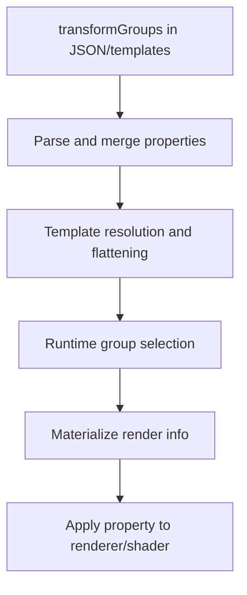

# Transform Group Value Propagation in CarryOn

This document explains how values defined in `transformGroups`—including custom properties such as `glowIntensity`—are parsed, merged, resolved, and ultimately applied in the entity carry renderer pipeline.

It reflects the current system, which is template-based and supports property propagation through template resolution, merging, and runtime rendering.

---

## 1. JSON Asset Definitions

Transform group values are defined in:
- Carryable patches (e.g., `resources/assets/carryon/patches/carryable/chandelier.json`)
- Transform template files (e.g., `assets/carryon/config/transformtemplates/*.json`)

Example (simplified):
```json
"transformGroups": {
  "hands": [
    {
      "id": "root",
      "rotation": [0, 0, 0],
      "glowIntensity": 0.3
    }
  ]
}
```
Any property (such as `glowIntensity`, `tintColor`, etc.) can be included in a transform group entry.

---

## 2. Parsing and Merging

### 2A. Parsing

- During asset loading, each transform group entry is parsed.
- Custom properties (e.g., `glowIntensity`) are read and stored in the transform group data structure.
- If a property is missing, a default value is used (e.g., `glowIntensity` defaults to `0`).

### 2B. Merging and Inheritance

- When multiple templates or local `transformGroups` are specified, definitions are merged in order:
  1. Template codes (in listed order)
  2. Local block `transformGroups` (last, highest precedence)
- Within a group, inheritance via `extends` and per-`id` merging ensures that properties like `glowIntensity` are overlaid or inherited as appropriate.
- If a group entry with the same `id` exists in both parent and child, properties are merged (child overrides parent).

---

## 3. Template Resolution

- The template system flattens all inherited and merged group definitions into a single `ResolvedTransformGroups` structure per carryable block.
- All properties, including custom ones, are preserved through this process.
- Special group modifiers (`^`, `@`, `~`) are applied before or after resolution as needed, but do not interfere with property propagation.

---

## 4. Runtime Rendering Flow

### 4A. Group Selection

- At runtime, the renderer selects the appropriate transform group based on slot, carried item type, and optional suffix mapping.
- The resolved group is retrieved from the `ResolvedTransformGroups` structure.

### 4B. Applying Properties

- Each transform group entry is materialized into a render info object.
- Properties such as `glowIntensity` are read from the group entry and passed to the renderer.
- For example, `glowIntensity` is used to set the `rgbGlowIn` vector for the shader:
  - All components of `rgbGlowIn` are set to the `glowIntensity` value (clamped 0–1).

Example (C#):
```csharp
Vec4f rgbGlowIn = new Vec4f(
    group.GlowIntensity,
    group.GlowIntensity,
    group.GlowIntensity,
    1f
);
```

### 4C. Shader/Material Usage

- The renderer passes the property (e.g., `rgbGlowIn`) to the shader or material system.
- The value is used to control the visual effect (e.g., glow) during rendering.

---

## 5. Summary Flow



---

## 6. References

- [Transform Template System](transform-template-system.md)
- [Entity Carry Renderer Pipeline](entity-carry-renderer-pipeline.md)
- `src/Client/Logic/CarryRenderer/CarryTransformPlanBuilder.cs`
- `src/Client/Logic/CarryRenderer/CarryRenderInfoBuilder.cs`
- Example patch: `resources/assets/carryon/patches/carryable/chandelier.json`

---
