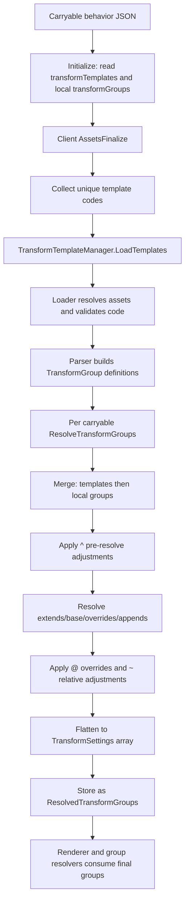

# Transform Template System in CarryOn

This document explains how the TransformTemplate system works in CarryOn.

It reflects the current implementation, which is client-side and lifecycle-driven:
- Carryable behavior patches can declare `transformTemplates` and local `transformGroups`.
- During client `AssetsFinalize`, all referenced templates are loaded once.
- Template definitions and local definitions are merged, resolved, and flattened into `ResolvedTransformGroups` per carryable block.

## 0. Overview: End-to-End Lifecycle

The template pipeline runs in this order:
1. JSON patches define carryable behavior properties (`transformTemplates`, optional `transformGroups`, optional `groups`).
2. `BlockBehaviorCarryable.Initialize` stores template codes and detects whether local transform groups exist.
3. `CarrySystem.AssetsFinalize` (client side):
   - collects unique template codes from all carryable blocks
   - loads template assets through `TransformTemplateManager.LoadTemplates`
   - calls `ResolveTransformGroups` on carryable blocks with templates and/or local groups
4. `BlockBehaviorCarryable.ResolveTransformGroups` invokes `TransformTemplateManager.ResolveAndFlattenTransformGroups`.
5. Runtime render code consumes `ResolvedTransformGroups`.

---

## 1. Where Templates Live and How They Are Addressed

Transform templates live under:
- `resources/assets/<domain>/config/transformtemplates/<code>.json`

Template code resolution rules:
- `carry-planter` -> domain defaults to `carryon`
- `carryon:carry-planter` -> explicit domain

Examples:
- `carryon:carry-planter` -> `assets/carryon/config/transformtemplates/carry-planter.json`
- `carryon:plants-large` -> `assets/carryon/config/transformtemplates/plants-large.json`

Load-time validations:
- Missing asset logs warning and template is skipped.
- Empty text logs warning and template is skipped.
- If JSON includes `"code"`, it must match the asset filename (without `.json`) or it is skipped.

---

## 2. Template JSON Structure

Each template JSON uses:
- top-level `code` (optional but validated if present)
- top-level `transformGroups` object

Group definition forms:
- Array shorthand: group value is an array of settings entries (treated as `base`).
- Object form: supports `extends`, `base`, `overrides`, `appends`.

Each settings entry can define:
- identity and source: `id`, `item` or `block`
- transform: `translation*`, `rotation*`, `scale*`, `origin*`
- render/material flags: `renderPass`, `normalShaded`, `cullFaces`, `alphaTestOpaque`, `alphaTestBlend`, `enabled`
- tinting: `tintColor`, `climateTintMap`, `seasonalTintMap`

Example (simplified):
```json
"transformGroups": {
  "default": [
    { "id": "root", "rotationY": 180.0 }
  ],
  "default-planted": {
    "extends": "default",
    "appends": [
      { "id": "soil", "item": "carryon:soil-planter" }
    ]
  },
  "hands": {
    "extends": "default",
    "overrides": [
      { "id": "root", "translationY": 0.2 }
    ]
  }
}
```

---

## 3. Merge and Precedence Rules

`TransformTemplateResolver.MergeDefinitions` merges definitions in this order:
1. template codes in listed order
2. local block `transformGroups` last

Implication:
- later templates override same-named groups from earlier templates
- local groups override template groups with the same name

Within one group resolve step:
- inherit parent via `extends` first
- apply `base`
- apply `overrides`
- append `appends`

`id`-aware upsert behavior:
- if incoming entry has `id` and target contains same `id`, entries are merged (overlay semantics)
- otherwise entry is added

Inheritance safety:
- cycles are detected and warned
- missing parent groups are warned

---

## 4. Prefix Control Groups: ^, @, ~

The resolver supports special prefixed groups that modify other groups and are removed from final output.

### `^target` (pre-resolve relative patch on definitions)
- Applied before inheritance flattening.
- Targets unresolved definition lists (`base`, `overrides`, `appends`).
- Used in current assets (for example planter variants of storage vessels and vats).
- If patch entry has `id`, it matches by `id`; if missing, only valid when target definition has exactly one entry.

### `@target` (post-resolve overlay override)
- Applied after groups are fully resolved.
- Upserts by `id` into resolved target list.
- Control group removed after application.

### `~target` (post-resolve relative adjustment)
- Applied after groups are fully resolved.
- Merges relatively by `id` into resolved target list.
- Entry without `id` is only allowed when target has exactly one resolved entry.
- Control group removed after application.

Parser guardrail:
- prefixed group names must use array syntax in JSON. If not, warning is logged and entry is skipped.

---

## 5. Parsing and Flattening into Runtime Settings

Parsing stage (`TransformTemplateParser`):
- Reads `transformGroups` into `Dictionary<string, TransformGroup>`.
- Accepts shorthand array groups and full object groups.
- Logs errors for invalid `base`/`overrides`/`appends` structures.

Flatten stage (`TransformTemplateResolver.FlattenResolved`):
- Converts resolved `TransformGroupSettings` lists into `TransformSettings[]`.
- Uses `BlockBehaviorCarryable.DefaultBlockTransform` defaults for unset values.
- Produces final `Dictionary<string, TransformSettings[]>`.

Storage:
- Result is assigned to `BlockBehaviorCarryable.ResolvedTransformGroups`.

---

## 6. Behavior Integration Points

`BlockBehaviorCarryable.Initialize`:
- reads and lowercases `transformTemplates`
- flags `HasLocalTransformGroups` when local `transformGroups` exists and has entries
- reads optional `groups` map into `TypeGroup` (used later for type suffixing)

`BlockBehaviorCarryable.ResolveTransformGroups`:
- if local groups exist, parses full behavior JSON and resolves templates + local groups
- if local parse fails, falls back to templates-only resolution
- if no local groups, resolves templates-only

`CarrySystem.AssetsFinalize` (client):
- instantiates `TransformTemplateManager`
- preloads all unique templates used by carryables
- resolves transform groups for all carryables that need them

---

## 7. Runtime Consumption

At render time, systems use `ResolvedTransformGroups` as already-materialized transform sets.

Runtime selection of which group key to use (for example `hands`, `backpack-small`, `backpack-small-normal`, `hands-planted`) is handled by renderer + resolver logic outside the template manager itself.

The template system's responsibility is:
- load template assets
- parse definitions
- merge templates + local definitions
- apply inheritance and control-group patch semantics
- flatten to final settings arrays

---

## 8. Example: Local Patch + Template Stack

Typical carryable behavior pattern:
```json
"transformTemplates": [
  "carryon:carry-chest",
  "carryon:carry-chest-compact"
],
"transformGroups": {
  "backpack-none-normal": { "extends": "backpack-none" },
  "backpack-small-normal": { "extends": "backpack-small" },
  "backpack-large-normal": { "extends": "backpack-large" }
}
```

Interpretation:
- base geometry/poses come from templates
- local aliases are layered last and can remap names or specialize variants
- final flattened output includes template groups plus local alias groups

---

## 9. Summary Flowchart



---

## 10. References

- `src/Client/Logic/TransformTemplates/TransformTemplateManager.cs`
- `src/Client/Logic/TransformTemplates/TransformTemplateLoader.cs`
- `src/Client/Logic/TransformTemplates/TransformTemplateParser.cs`
- `src/Client/Logic/TransformTemplates/TransformTemplateResolver.cs`
- `src/Common/Behaviors/BlockBehaviorCarryable.cs`
- `src/CarrySystem.cs`
- `resources/assets/carryon/config/transformtemplates/carry-planter.json`
- `resources/assets/carryon/config/transformtemplates/plants-large.json`
- `resources/assets/carryon/config/transformtemplates/carry-storagevessel-planter.json`

---

## See Also

- [Carried Chest-Trunk and Chest Rendering](carried-chest-trunk-rendering.md) — Worked example of `transformTemplates` and local `transformGroups` for chest and trunk blocks.
- [Carried Plant Container Rendering](carried-plant-container-rendering.md) — Worked example of `transformTemplates` combined with a `renderTransformResolver` for flowerpots and planters.
- [Entity Carry Renderer Pipeline](entity-carry-renderer-pipeline.md) — How `ResolvedTransformGroups` produced by this pipeline are consumed at render time (Sections 5 and 7).

---

This document is intended as a technical reference for understanding and debugging the TransformTemplate pipeline in CarryOn.
